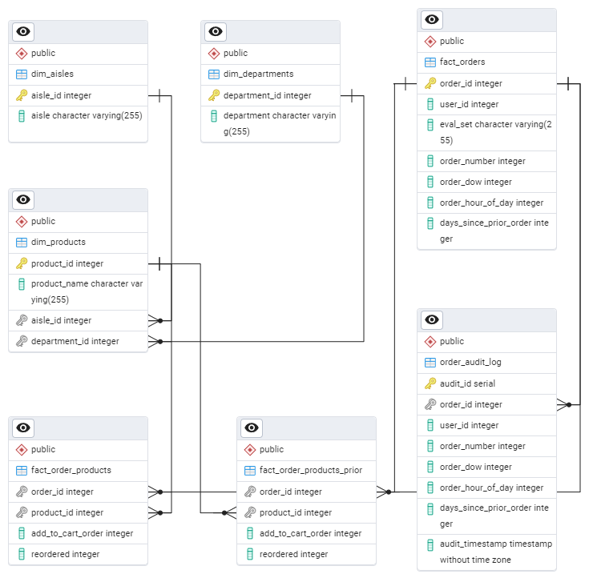

# Instacart Data Pipeline Using Apache Airflow

## 1. Project Overview

This project aims to create a comprehensive data processing pipeline and other data analysis for [Instacart market basket analysis dataset](https://www.kaggle.com/competitions/instacart-market-basket-analysis/data). The implementation involves 
- **Setting up a PostgreSQL database**
- **Creating a custom Python package to manage the ETL functions**
- **Workflow automation using a custom Docker image based on Apache Airflow**
- **Exploratory analysis using Python and SQL**

## 2. Project Structure

### 2.1. Database Setup



- **Creation**: Create a PostgreSQL database named `instacart_db`
- **Initialization**: The database is initialized to create tables, views, triggers and stored procedures. This can by done manually using the sql scripts in `sql` directory or by  triggering the `Database_Setup` dag
- **Views**:
    - Organic v/s non organic products
    - Reorder proportion by product
    - Customers who always reorder
    - See the top 10 products sold
- **Triggers**:
    - Maintain an audit log whenever a new order is inserted into the fact_orders table
    - Ensure that the add_to_cart_order is always a positive integer

### 2.2. Create instacart_data_pipeline Package

#### Set Environment Variables & Configuration

Create a `.env` file on the same level as `setup.py`

`.env` example
```bash
INSTACART_CONFIG_FILE_PATH=./path/to/yout/config.yaml
```

`config.yaml` example
```bash
database:
  host: localhost
  port: 5432
  user: postgres
  password: postgres
  dbname: instacart_db

data_ingestion:
  source_url: https://p-def3.pcloud.com/D4ZyfN51vZ8h8Haj7ZZZddHxXkZ2ZZ8uXZkZPO7ZO8ZrHZSRZfiRp5ZLuqC8451j00IAlmoLLJNlQrWVTXV/instacart_dataset.zip
  download_dir: ./data/raw
  unzip_dir: ./data/raw
  filename: instacart_dataset.zip

data_transformation:
  source_dir: ./data/raw
  output_dir: ./data/processed
  
data_loading:
  source_dir: ./data/processed
```

#### Create a Source Distribution

The `src` folder contains all the source modules and packages. Use the `setup.py` to create a source distribution of instacart_data_pipeline package

```python
python setup.py sdist
```

### 2.3. Build a Custom Airflow Image

#### Set Environment Variables

You can set environment variables in the `docker-compose.yml` or create a `.env` file in the same directory. Provide the config file for instacart_data_pipeline package in `/ariflow/config`

`.env` example
```bash
AIRFLOW_UID=50000
```

`instacart_config.yaml` example
```bash
database:
  host: host.docker.internal
  port: 5432
  user: postgres
  password: postgres
  dbname: instacart_db

data_ingestion:
  source_url: https://p-def3.pcloud.com/D4ZyfN51vZ8h8Haj7ZZZddHxXkZ2ZZ8uXZkZPO7ZO8ZrHZSRZfiRp5ZLuqC8451j00IAlmoLLJNlQrWVTXV/instacart_dataset.zip
  download_dir: ./data/raw
  unzip_dir: ./data/raw
  filename: instacart_dataset.zip

data_transformation:
  source_dir: ./data/raw
  output_dir: ./data/processed
  
data_loading:
  source_dir: ./data/processed

```

#### Create custom Airflow Image

Navigate to the airflow directory
```
cd airflow
```
Build the image and run the airflow container
```bash
docker compose up --build
```

### 2.4. Running the Container

#### Access the webserver 

The webserver is available at: http://localhost:8080. The default account has the login ***airflow*** and the password ***airflow***

#### Set Connections

Example connection
```bash
Connection id   - postgres_default
Connection Type - postgres
Host            - host.docker.internal
Database        - instacart_db
Login           - Postgres
Port            - 5432
```

#### Modify PostgreSQL Server Configuration

Ensure that PostgreSQL server is up and running. By default the PostgreSQL server running on the host is configured to accept connection from localhost only. You need to edit the `pg_hba.conf` file to include

```
host    all             all             172.17.0.1/32            scram-sha-256
```
This entry allows all users to connect to all databases from the IP address 172.17.0.1 (replace with your gateway address) using the scram-sha-256 authentication method.

To find your gateway address 
```bash
# Find your container's network (by default container name is airflow-default running on bridge network)
docker network ls

# Inspect the network settings and find the gatway parameter
docker inspect <container_name_or_ID>
```

Restart PostgreSQL service to ensure changes are applied

#### Stopping the Container

```bash
cd airflow
docker compose down
```

### 2.5. Exploratory Analysis Using Python & SQL

The [dataset](https://u.pcloud.link/publink/show?code=XZfiRp5ZvAhSLHjJjb08X96ta6FJnX8pqWKX) and [schema](https://gist.github.com/jeremystan/c3b39d947d9b88b3ccff3147dbcf6c6b) are available.... 

Data Analysis was conducted in both Python and SQL to answer the following questions
1. When do people order - Hour of day, Day of week ?
2. How many days since the recent order ?
3. How many prior orders are there ?
4. What is the most common basket size ?
5. What are the top 10 products sold ?
6. What is the proportion of reordered orders ?
7. What are the most frequently reordered products ?
8. Which are the top 10 items added to cart first ?
9. Association between days since last order and reorder trends
10. Association between number of orders and probability of reordering
11. Percentage of Organic v/s Non-Organic products
12. Percentage of Organic v/s Non-Organic re-orders
13. Product Portfolio
14. Sales Portfolio

## 3. How to Run the Pipeline

The preceding sections detail each step of the pipeline.  This section provides a summary of the overall process.

- Create the PostgreSQL database (on the Host)
- Ensure Docker Desktop Community edition is installed and running
- Set the environment variables and config file for the airflow container
- Build and Start the Airflow container
- Navigate to  http://localhost:8080 and login with default credentials (username - airflow, password - airflow)
- Set the Connections
- Trigger the `Database_Setup` dag (once)
- `ETL_Pipeline` dag is scheduled to trigger daily


